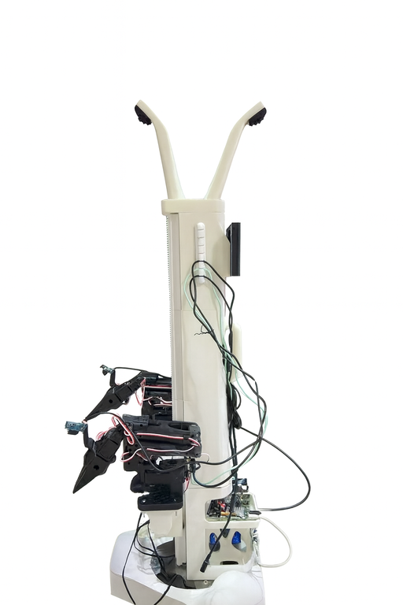

## 前言

lerobot_alohamini相较于原版lerobot，显著增强了调试能力，并适配了AlohaMini轮式双臂机器人硬件（基于Lekiwi扩展）。

关于新增的调试命令，具体参看：
[debug命令汇总](examples/debug/README.md)

AlohaMini硬件预览图   
  


## 开始使用（Ubuntu系统）

*** 强烈建议按顺序进行 ***

### 1. 准备工作

####　网络环境测试
```
curl https://www.google.com
curl https://huggingface.co
```
首先确保网络通畅

####　cuda环境测试
```
nvidia-smi
```
在终端输入后，应当可以看到cuda版本号


### 2. 克隆lerobot_alohamini仓库

```
cd ~
git clone https://github.com/liyitenga/lerobot_alohamini.git
```

### 3. 串口授权
默认权限无法访问串口，我们需要对端口进行授权，lerobot官方文档的案例是将串口权限修改为666，实践中发现每次重启电脑都要重新设置，非常麻烦，建议直接将当前用户添加到设备用户组，永久解决该问题。
1. 终端键入`whoami`  //查看当前用户名
2. 键入`sudo usermod -a -G dialout username` //永久添加username到设备用户组
3. 重启电脑，以让权限生效

### 4. 安装conda3及环境依赖

安装conda3
```
mkdir -p ~/miniconda3
wget https://repo.anaconda.com/miniconda/Miniconda3-latest-Linux-x86_64.sh -O ~/miniconda3/miniconda.sh
bash ~/miniconda3/miniconda.sh -b -u -p ~/miniconda3
rm ~/miniconda3/miniconda.sh
~/miniconda3/bin/conda init bash
source ~/.bashrc
```

初始化conda3
```
conda create -y -n lerobot_alohamini python=3.10
conda activate lerobot_alohamini
```

安装环境依赖
```
cd ~/lerobot_alohamini
pip install -e .[all]
conda install ffmpeg=7.1.1 -c conda-forge
```

### 5. 配置机械臂端口号


Alohamini一共有4条机械臂，2条主臂连接pc电脑，2条从臂连接树莓派，共4个端口。

由于每次重新插拔，都会使端口号改变，因此要熟练掌握查找端口号的操作，后期熟练后，可以使用硬连接进行端口固化。

如果您直接购买的AlohaMini整机，则整机自带的树莓派已固化了2条从臂的端口号，无需再次配置。


将机械臂连接好电源，并通过USB与电脑相连，查找机械臂的端口号。

方法1：
通过脚本查找端口：
```
cd ~/lerobot_alohamini

lerobot-find-port
```

方法2：
可以在终端直接输入命令，根据每次插入后显示的端口号的不同，来依次确认插入的端口号

```
ls /dev/ttyACM*
```

**查找到正确的端口后，请修改下列文件中对应的端口号
从臂：lerobot/robots/alohamini/config_lekiwi.py
主臂：examples/alohamini/teleoperate_bi.py**

注：每次重新插拔机械臂或重启电脑后，都要执行该操作

### 6. 配置摄像头端口号

树莓派中已内置了摄像头端口，无需配置：
lerobot/robots/alohamini/config_lekiwi.py


注意：
- 多个摄像头不能插在一个USBHub上，1个USBHub仅支持1个摄像头


### 7. 摇操校准及测试


#### 7.1设置机械臂中位

host端校准：
我们ssh进入树莓派，安装好conda环境后，执行下列操作：

```
python -m lerobot.robots.alohamini.lekiwi_host
```

如果是第一次执行，系统会提示我们进行机械臂校准，将机械臂摆放到如图姿态，按下回车，然后对每个关节左转90度，然后右转90度，然后回车
  


client端校准：
执行下面命令，将ip替换为host端树莓派的真实ip，然后重复上述步骤
```
python examples/alohamini/teleoperate_bi.py \
--remote_ip 192.168.50.43
```

#### 7.2 摇操指令汇总

树莓派端：

```
python -m lerobot.robots.alohamini.lekiwi_host
```

PC端：
```
//正常摇操
python examples/alohamini/teleoperate_bi.py

//摇操(不连host，用于调试)
python examples/alohamini/teleoperate_bi.py --use_dummy

//带语音功能的摇操
python examples/alohamini/teleoperate_bi_voice.py

//带语音功能的摇操(不连host，用于调试)
python examples/alohamini/teleoperate_bi_voice.py --use_dummy


注意：语音功能需要安装依赖,并设置DASHSCOPE_API_KEY

//安装语音依赖
conda install -c conda-forge python-sounddevice
pip install dashscope


//到阿里百炼官网，申请一句话识别API，执行下列命令，将API放入环境变量

export DASHSCOPE_API_KEY="sk-434f820ebaxxxxxxxxx"
```

### 8. 录制数据集

#### 1 注册huggingface，获取并配置key

1.进入HuggingFace网站（huggingface.co），申请{Key}，记得带读写权限

2.将API token添加到Git凭据中

```
git config --global credential.helper store

huggingface-cli login --token {key}--add-to-git-credential

```

#### 2 运行脚本

修改repo-id参数，然后执行：

```
HF_USER=$(huggingface-cli whoami | head -n 1)
echo $HF_USER

```

```
python examples/alohamini/record_bi.py \
  --num_episodes 1 \
  --fps 30 \
  --episode_time 45 \
  --reset_time 8 \
  --task_description "pickup1" \
  --remote_ip 127.0.0.1

```

### 9. 重放数据集
```
python examples/alohamini/replay_bi.py  \
--dataset $HF_USER/so100_bi_test \
--episode 0 \
--remote_ip 127.0.0.1
```

### 10. 数据集可视化
```
  lerobot-dataset-viz \
  --repo-id $HF_USER/so100_bi_test \
  --episode-index 0
```


### 11. 重新播放数据集
```
python lerobot/scripts/control_robot.py \
  --robot.type=so100 \
  --control.type=replay \
  --control.fps=30 \
  --control.repo_id=$HF_USER/so100_bi_test\
  --control.episode=0
```

### 12. 本地训练
//act

```
lerobot-train \
  --dataset.repo_id=$HF_USER/so100_bi_test \
  --policy.type=act \
  --output_dir=outputs/train/act_your_dataset1 \
  --job_name=act_your_dataset \
  --policy.device=cuda \
  --wandb.enable=false \
  --policy.repo_id=liyitenga/act_policy
```


### 13. 远程训练
以AutoDL为例：
申请一张4070显卡，容器镜像选择Python  3.8(ubuntu20.04) Cuda  11.8或以上，并用终端登录
```
//进入远程终端，初始化conda
conda init

//重启终端，创建环境
conda create -y -n lerobot python=3.10
conda activate lerobot

//学术加速
source /etc/network_turbo

//获取lerobot
git clone https://github.com/liyitenga/lerobot_alohamini.git

//安装必要文件
cd ~/lerobot_alohamini
pip install -e ".[feetech,aloha,pusht]"
```

运行训练命令

最后安装FileZilla，将训练好的文件取回
````
sudo apt install filezilla -y
````

### 14. 评估训练集

用filezilla将训练好的模型拷贝到本地，并运行如下命令即可：

```
python examples/alohamini/evaluate_bi.py \
  --num_episodes 3 \
  --fps 20 \
  --episode_time 45 \
  --task_description "Pick and place task" \
  --hf_model_id liyitenga/act_policy \
  --hf_dataset_id liyitenga/eval_dataset \
  --remote_ip 127.0.0.1 \
  --robot_id my_alohamini \
  --hf_model_id ./outputs/train/act_your_dataset1/checkpoints/020000/pretrained_model
  
````
